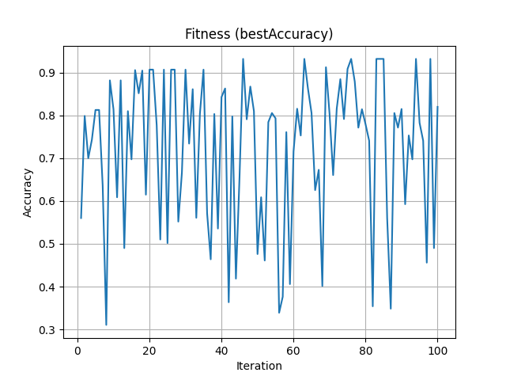

# 🔍 Letter Recognition Using NuSVC (Support Vector Machine)

This project uses the Letter Recognition dataset from the UCI Machine Learning Repository to classify English capital letters (A–Z) based on 16 numerical features. We apply Support Vector Machines (NuSVC) with random hyperparameter tuning over 10 iterations for multiple samples.

---

## ⚙️ Methodology

1. 🔄 Preprocessing:
   - Dataset loaded from UCI.
   - The dataset is mostly balanced, but to reduce runtime, we sampled 230 rows per letter (for 26 letters), totaling 5,980 rows.
   - The target variable (letter) was label-encoded for training.

2. 🧪 Experiment:
   - 10 random samples created using different random states.
   - Each sample was split into 70% training and 30% testing.
   - For each sample, 100 random hyperparameter combinations were tried:
     - Kernels: linear, poly, rbf, sigmoid
     - Nu: 0.01 to 0.9
     - Gamma: scale (for linear) or random float for others
   - Accuracy was evaluated and the best configuration was recorded.

3. 📉 Convergence Tracking:
   - For each sample, the accuracy per iteration was stored to observe convergence.
   - The best-performing sample’s convergence was plotted.

---

## 📈 Sample Results (Top 5)

| Sample | Best Accuracy | Best SVM Parameters                        |
|--------|---------------|--------------------------------------------|
| S1     | 91.08         | Kernel: rbf, Nu: 0.12, Gamma: 0.137        |
| S2     | 90.41         | Kernel: poly, Nu: 0.02, Gamma: 0.445       |
| S3     | 91.53         | Kernel: rbf, Nu: 0.24, Gamma: 0.108        |
| S4     | 92.92         | Kernel: rbf, Nu: 0.19, Gamma: 0.055        |
| S5     | 92.14         | Kernel: rbf, Nu: 0.17, Gamma: 0.122        |

📄 [Download Full Results (CSV)](./SVM_Results.csv)

---

## 📊 Convergence Plot (Best Sample)

This graph shows how the model's accuracy evolved over 100 iterations for the best-performing sample (e.g., S9).

---

## 📚 Dataset Reference

Letter Recognition Data Set - UCI Machine Learning Repository  
https://archive.ics.uci.edu/ml/datasets/letter+recognition
